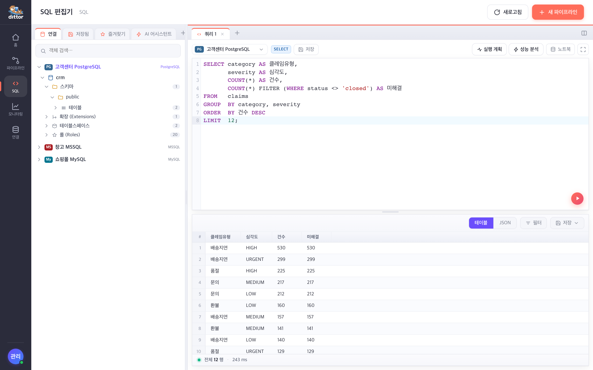
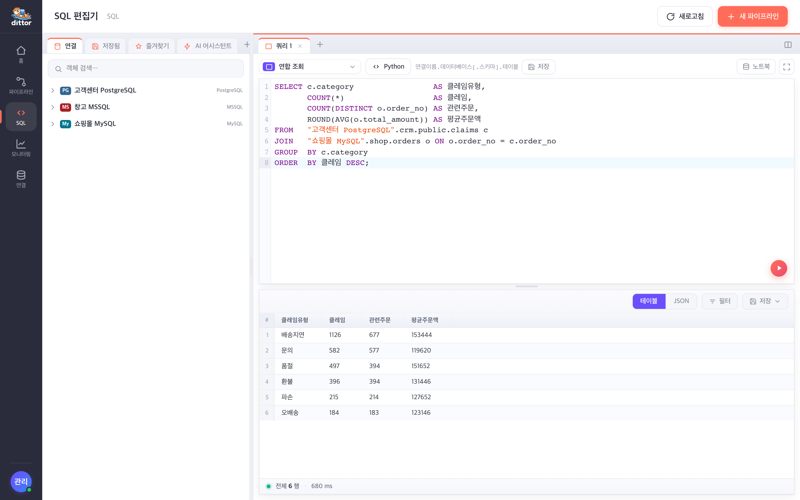
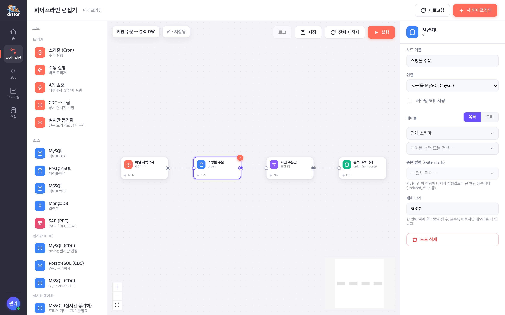
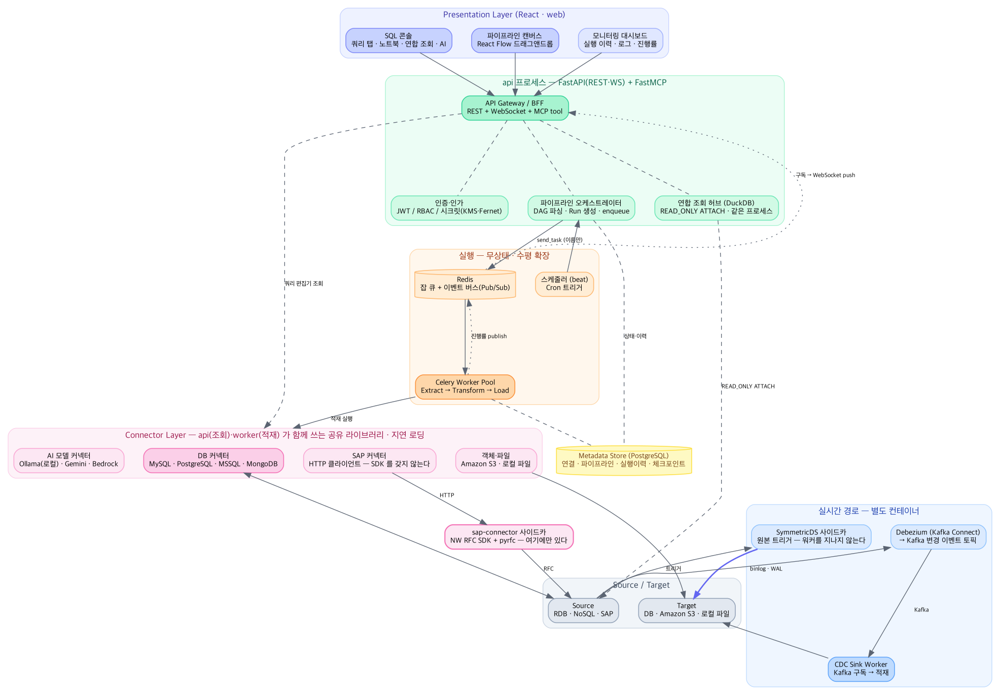
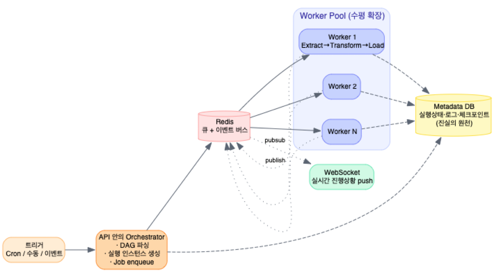

# ditter

**한국어** · [English](README.en.md)

운영 중인 여러 이기종 데이터소스에 **읽기 전용으로** 붙어, 위험한 쿼리를 실행 전에 잡아내며
안전하게 조회하는 **웹 SQL 콘솔**. 그렇게 확인한 안전한 조회를 반복 적재로 굳히는
**데이터 파이프라인**이 그 위에 얹힌다.

- **SQL 콘솔** — MySQL · PostgreSQL · MSSQL · MongoDB · S3 · SAP · 로컬파일에 한 화면에서 붙어
  조회한다. 쿼리 탭 · 스키마 탐색 · **EXPLAIN / 성능 분석** · 노트북 모드 · 저장된 쿼리 · 즐겨찾기 ·
  결과 그리드(테이블/JSON) · 내보내기. 서로 다른 연결을 한 SELECT 로 잇는 **연합 조회(DuckDB)** 까지.
- **읽기 전용 안전장치** — 기본이 **읽기 전용**이다. 위험 문장은 실행 전에 판정·차단하고, 쓰기는
  **문장별로 명시 허용한 것만** 통과한다. 편집기·노트북·연합 탭 어디서 실행해도 같은 검사를 거친다.
- **트랜잭션 제어** — 쓰기는 **자동/수동 커밋** 토글로 다룬다. 수동이면 결과를 확인한 뒤 커밋 또는
  롤백 — 잘못 돌린 UPDATE 를 되돌릴 수 있는 유일한 자리다.
- **데이터 파이프라인** — 웹에서 드래그앤드롭(n8n 스타일)으로 구성해 **배치·실시간(CDC)** 으로 적재한다.
- **AI 어시스턴트** — 자연어로 SQL 생성·튜닝·오류 수정. 모델은 DB 와 똑같이 **커넥터 플러그인**이라
  **로컬 오픈웨이트 모델(Ollama)** 로 상용 API 없이 돌아간다. Gemini·Bedrock 은 선택지 중 하나다.
- **MCP** — 모든 기능을 MCP tool 로 노출해, UI 와 LLM/에이전트가 **같은 서비스 계층**을 재사용한다.

상세 설계는 [docs/ARCHITECTURE.md](docs/ARCHITECTURE.md),
구현 가이드는 [CLAUDE.md](CLAUDE.md)를 참고.
원본 기획 문서([docx](docs/EAI_아키텍처_설계문서.docx) · [pdf](docs/EAI_아키텍처_설계문서.pdf))는
**부록**으로 남는다 — 바이너리라 diff 도 리뷰도 되지 않는다.

---

## 화면

아래 화면은 모두 `demo/` 의 시연용 목데이터로 찍었다 — 실제 데이터가 아니다.

### SQL 콘솔

서로 다른 DB 를 한 트리에 두고 조회한다. 툴바의 **`SELECT` 태그**가 이 연결로 무엇을 할 수
있는지 실행 전에 알려 준다 — 이 연결은 조회만 열려 있다.



### 연합 조회 — 서로 다른 DB 를 한 SELECT 로

고객센터(PostgreSQL)의 클레임과 쇼핑몰(MySQL)의 주문을 **한 문장으로 조인**한다.
DuckDB 를 가운데 두지만 사용자가 아는 것은 「연결 관리」에 저장해 둔 이름뿐이다.



### 파이프라인 캔버스

확인한 조회를 반복 적재로 굳힌다. 좌측 팔레트 · 중앙 캔버스 · 우측 노드 설정.



> AI 어시스턴트(자연어 → SQL·튜닝·오류 수정)는 [아래 절](#ai-모델--상용-api-없이-돌아간다)에서
> 따로 설명한다. **상용 API 없이 로컬 오픈웨이트 모델로도 그대로 돈다.**

---

## 현재 구현 범위

| Phase | 내용 | 상태 |
|---|---|---|
| 0 | 모노레포·docker-compose·메타DB 모델·마이그레이션 | ✅ 완료 |
| 1 | MVP — MySQL/PostgreSQL 커넥터, S3 타깃, 스케줄러, Canvas 저작, 실행/이력 | ✅ 완료 |
| 2 | MSSQL/MongoDB 커넥터, RBAC 로그인, Monitor 고도화, 팬아웃 스풀링 | ✅ 완료 |
| 3 | SAP RFC 전용 사이드카 (BAPI · RFC_READ_TABLE) | ✅ 완료 |
| 4 | CDC (Debezium) — MySQL/PostgreSQL/MSSQL 실시간 수집, Sink Worker | ✅ 완료 |
| 5 | 운영 고도화 (오토스케일·HA/DR·감사) | ⬜ 예정 |

> 그 밖에 **변환 노드**를 확장했다 — Python 전처리 노드(격리 서브프로세스·pandas·행/배치 모드),
> 스위치(조건 분기) 노드. 아래 참조.

**SQL 콘솔 (쿼리 편집기)**

- 다중 이기종 연결에 붙는 웹 쿼리 편집기 — 쿼리 탭 · 스키마 탐색기 · 저장된 쿼리 · 즐겨찾기 패널.
- **EXPLAIN / EXPLAIN ANALYZE** 로 실행 계획·성능을 그 자리에서 확인(PostgreSQL·MySQL).
- **노트북 모드** — 셀 단위 실행 · 메모(md) 셀 · 블록 재실행.
- **연합 조회(DuckDB)** — 서로 다른 연결의 테이블을 한 SELECT 로 조인(READ_ONLY ATTACH).
- 결과 그리드(테이블/JSON · 컬럼 폭 조절 · 필터) · 내보내기.
- **읽기 전용이 기본.** 위험 문장은 실행 전에 판정·차단하고, 쓰기는 연결별로 문장을 **명시
  허용한 것만** 통과한다(허용 태그가 툴바에 표시). 쓰기는 수동 커밋으로 결과를 확인한 뒤 커밋/롤백.

**변환 노드 확장 (최근)**

- **Python 전처리 노드** — 사용자 Python 코드로 레코드를 변환. 임의 코드라 **격리 자식 프로세스**에서
  실행(시크릿·메타DB·네트워크 차단, rlimit·타임아웃). `pandas` 기본 제공. 두 모드: `transform(row)`
  행 단위 스트리밍 / `transform_batch(df)` 전체 행을 DataFrame 으로 한 번에.
- **스위치(조건 분기) 노드** — 각 행을 처음 맞는 case 의 출력으로, 아무 것도 안 맞으면 '그 외' 출력으로
  라우팅. 출력이 여러 개인 다중 출력 노드(엣지가 `source_handle` 로 어느 case 인지 가리킨다).
- 코드 편집기는 CodeMirror(문법 하이라이트·크게 편집 팝업).

**Phase 4 에서 추가된 것**

- **Debezium 기반 CDC** — MySQL · PostgreSQL · MSSQL 소스를 실시간 수집. Kafka 토픽을 구독하는
  **Sink Worker**(`cdc_sink`)가 타깃에 적재한다. 무상태라 수평 확장된다.
- CDC 소스 노드(파랑, 실시간 그룹)·CDC 스트림 트리거·스냅샷 모드(initial/never/when_needed)·삭제 처리.
- Kafka·Debezium·Sink 는 `docker compose --profile cdc up -d` 로만 기동한다(배치 파이프라인과 분리).

**Phase 3 에서 추가된 것**

- SAP RFC 전용 사이드카 — NW RFC SDK 와 SAP 자격증명을 그 컨테이너 안에만 가둔다
- BAPI 호출 (권장) · RFC_READ_TABLE (512자 행폭 자동 분할, 72자 WHERE 분할)
- 목 백엔드 — SDK 없이 개발·CI. **512자 제약을 실제와 동일하게 강제**한다
- SAP 노드(핑크), 필드 선택 시 512자 초과 여부를 미리 표시

**Phase 2 에서 추가된 것**

- MSSQL(pyodbc·MERGE upsert) · MongoDB(JSON 필터·문서 정규화) 커넥터
- 로그인 화면 + JWT + 역할별 UI 제어 (viewer / operator / editor / admin)
- 사용자 관리 API와 CLI (`python -m eai_api.cli create-admin`)
- 실행 상세 화면 — 노드별 분해, 재실행, 로그 레벨·노드 필터
- 팬아웃 스풀링 — 분기가 있어도 소스를 **한 번만** 읽는다

**Phase 1 에서 동작하는 것**

- 연결 등록·테스트·스키마 탐색 (MySQL / PostgreSQL / S3)
- 시크릿 분리 저장 (Fernet 또는 AWS KMS) — 원문은 메타DB에 남지 않음
- 드래그앤드롭 파이프라인 편집기 (React Flow), 버전 스냅샷
- DAG 실행: 위상 정렬 → Extract → Transform(필터·필드매핑·Python·스위치) → Load
- 증분 적재(watermark) + 체크포인트, `full_refresh` 전체 재적재
- 멱등 적재: DB는 upsert/overwrite, S3는 실행 단위 경로 분리
- Cron 스케줄러 (중복 실행 방지), 수동 실행, 실행 취소
- WebSocket 실시간 진행률·로그, 실행 이력·대시보드 통계
- MCP 도구 12종 — UI와 동일한 서비스 계층을 LLM/에이전트가 재사용

---

## 빠른 시작

### 1. 환경 변수

```bash
cp .env.example .env
```

`.env`의 빈 값을 채운다.

```bash
python -c "from cryptography.fernet import Fernet; print(Fernet.generate_key().decode())"
```

```bash
openssl rand -hex 32
```

앞의 값을 `EAI_LOCAL_SECRET_KEY`, 뒤의 값을 `EAI_JWT_SECRET`에 넣는다.

### 2. 전체 기동 (Docker)

```bash
docker compose up -d --build
```

- 웹 http://localhost:5173
- API 문서 http://localhost:8000/docs
- MCP 엔드포인트 http://localhost:8000/mcp-server/mcp

### 3. 로컬 개발 (인프라만 컨테이너로)

```bash
docker compose up -d postgres redis
```

```bash
uv venv --python 3.12 && uv pip install -e apps/connectors -e apps/api -e apps/worker
```

```bash
cd apps/api && alembic upgrade head && uvicorn eai_api.main:app --reload
```

```bash
celery -A eai_worker.celery_app:app worker -l info -Q eai.default
```

```bash
python -m eai_worker.scheduler
```

```bash
cd apps/web && npm install && npm run dev
```

### 4. 첫 관리자 계정

인증이 켜져 있으면 로그인해야 하므로, 서버에서 먼저 관리자를 만든다.

```bash
cd apps/api && python -m eai_api.cli create-admin admin@company.com
```

비밀번호는 대화형으로 입력받는다 — 인자로 주면 셸 히스토리에 남는다.
로컬 개발 중 인증을 끄려면 `EAI_AUTH_ENABLED=false`.

---

## 직접 해보기 — 시연용 가상 DB

빈 화면으로는 이 도구가 무엇을 하는지 보이지 않는다. 그래서 **한 회사의 세 시스템이 서로 다른
DB 에 흩어진 상황**을 로컬에 그대로 재현해 두었다.

| DB | 무엇이 들어 있나 |
|---|---|
| MySQL `shop` | 온라인 쇼핑몰 — 주문·고객·상품·결제 |
| SQL Server `wms` | 사내 온프레미스 창고관리 — 재고·로케이션·입출고 |
| PostgreSQL `crm` / `dw` | 고객센터 클레임 / **적재 타깃(비어 있음)** |

*주문은 MySQL, 재고는 사내 MSSQL, 클레임은 PostgreSQL 에 있다. 지연 주문의 원인을 보려면
지금은 세 팀에 각각 물어봐야 한다* — [연합 조회](#연합-조회--서로-다른-db-를-한-select-로)와
[파이프라인](#파이프라인-캔버스)이 답하는 것이 이 상황이다.

**본체 스택을 먼저 띄워야 한다.** 데모 DB 는 본체가 만든 네트워크에 올라타므로, api·worker 가
`mysql-shop:3306` 처럼 컨테이너 이름으로 찾아간다.

```bash
docker compose up -d
```

```bash
bash demo/scripts/up.sh
```

```bash
bash demo/scripts/seed.sh
```

`up.sh` 는 컨테이너와 스키마까지, `seed.sh` 는 목데이터를 넣는다(수 분). **난수 시드가 고정**이라
`bash demo/scripts/reset.sh` 로 지웠다 다시 만들어도 화면의 숫자가 같다.

계정은 역할별로 나뉜다 — `eai_ro`(조회만) · `eai_rw`(DML) · `eai_ddl`(DDL). 화면의
[허용 명령](#sql-콘솔)만이 아니라 **DB 권한으로도** 읽기 전용이 기본이라는 것을 보여주는 자리다.

접속 정보·데이터 설계·주의사항은 [demo/README.md](demo/README.md). 위 [「화면」](#화면)의
스크린샷 세 장도 전부 이 스택으로 찍었다.

> 본체와 **별도 도커 프로젝트**라 `bash demo/scripts/down.sh -v` 한 번이면 볼륨까지
> 흔적 없이 사라진다. 사내 실데이터는 넣지 않는다 — 그러라고 만든 것이 이 스택이다.

---

## 테스트 · 품질

Python 앱은 `uv`, 웹은 `npm` 으로 돌린다. `<영역>` 은 `connectors`·`api`·`worker`·`sap-connector`.

```bash
cd apps/<영역> && uv run --extra dev pytest -q && uv run --extra dev ruff check .
```

```bash
cd apps/web && npm test && npm run lint && npm run build
```

**현재 상태 — 테스트 1,278개 통과** (Python 996 · 프론트 282).

| 검사 | 상태 |
|---|---|
| pytest · vitest | ✅ 통과 — CI 가 막는다 |
| ruff | ✅ 통과 — CI 가 막는다 |
| eslint · tsc(빌드) | ✅ 통과 — CI 가 막는다 |
| mypy (strict) | ⚠️ **아직 아니다** — `src` 기준 127건 남음(대부분 `apps/api`) |

mypy 는 설정만 strict 이고 실제로는 통과하지 않는다. 상시 빨간 CI 를 만들지 않으려고
게이트에서 빼 두었고, 줄여 나가는 중이다. 그 밖의 검사는 모두 CI 가 PR 마다 강제한다.

MSSQL 커넥터 테스트는 `pyodbc` 가 필요하다. macOS 에서 `libodbc` 를 못 찾아 실패하면
`brew install unixodbc` 로 해결된다 (CI 는 `unixodbc-dev` 를 설치한다).

---

## 구조



> 이 그림이 담은 것은 **파이프라인 쪽**이다. SQL 콘솔 · 연합 조회 · AI 어시스턴트는 여기 그려진
> 것과 **같은 API 계층 위에** 얹힌다 — 위 [「화면」](#화면) 절이 그쪽이다.
> 인증은 현재 **JWT + RBAC** 이고, 그림의 `OAuth2` 는 아직 스키마(`users.external_id`)만
> 준비된 상태다 (CLAUDE.md §15).

```
apps/
  connectors/   BaseConnector 계약 — 커넥터 10종 · 소스/타깃 7종
                (MySQL·PostgreSQL·MSSQL·MongoDB·SAP RFC·S3·로컬파일)
                + AI 모델 3종 (Gemini·Bedrock·Ollama) — 지연 로딩
  api/          FastAPI(REST/WS) + FastMCP, 모델·Alembic, 인증(JWT/RBAC), 서비스 계층, 운영 CLI
  worker/       Celery 워커 — DAG 엔진, 노드 실행기(Python 격리 샌드박스 포함), 팬아웃 스풀,
                Cron 스케줄러, CDC Sink Worker
  sap-connector/ SAP RFC 전용 사이드카 — NW RFC SDK 격리, 목 백엔드 포함
  web/          React + React Flow — Login / Home / Canvas / Monitor / Connections
cdc/debezium/   Debezium(Kafka Connect) 커넥터 설정 — MySQL·PostgreSQL·MSSQL 예시
infra/          ECS task def, Terraform (예정)
docs/           설계 문서, UI 목업, 아키텍처 다이어그램
```

의존 방향: `web → api → worker`는 없다. API와 Worker는 **Redis 큐로만** 통신하고
(`send_task` 이름 호출), 모델·DAG 스펙·커넥터만 코드로 공유한다.

그래서 워커는 무상태이고 **수평으로 늘릴 수 있다.** 실행 상태·로그·체크포인트는 전부
메타DB 에 있고, 진행 상황은 WebSocket 으로 화면에 밀어 준다.



> 다이어그램 원본(`.dot`)은 [docs/diagrams/](docs/diagrams/) 에 있다 — 고쳐서 다시 그릴 수 있다.

구조와 설계 결정의 전문은 **[docs/ARCHITECTURE.md](docs/ARCHITECTURE.md)** 에 있다 —
실행 모델과 그 의도된 한계, 커넥터 계약, 새 것을 붙이는 법, 그리고 **택하지 않은 것과 그 이유**.

---

## 알아둘 설계 결정

- **큐 모드는 PostgreSQL + Redis 필수.** SQLite는 설정 단계에서 거부한다.
- **워터마크는 적재가 끝난 뒤에만 전진한다.** 적재 전에 올리면 실패 구간이 영구 유실된다.
- **한 노드가 여러 소비자를 가지면 스풀을 거친다.** 첫 소비 때 JSONL 로 디스크에 적고 나머지는
  되읽어, 분기가 있어도 소스는 정확히 한 번만 읽힌다. 그래서 **타깃은 순차 실행해야 한다** —
  병렬로 돌리면 스풀이 완성되기 전에 두 번째 소비자가 붙는다.
- **여러 상류가 한 노드로 모이면 순차 concat(UNION ALL).** 조인은 별도 노드로 다룰 일이다.
- **S3는 upsert 불가.** 실행 단위 경로(`run_id=<id>/`) 분리로 멱등성을 얻는다.
- **FastMCP 버전은 핀 고정.** 2.10.x는 pydantic 2.13과 호환되지 않는다 — 올릴 때 반드시 확인.
- **SAP 은 사이드카로 격리한다.** NW RFC SDK 는 라이선스 바이너리라 저장소에 없다.
  워커는 SDK 없이 HTTP 로만 이야기하고, SAP 자격증명은 사이드카 컨테이너 안에만 있다.
- **RFC_READ_TABLE 은 행폭 512자·OPTIONS 줄 72자 제약이 있다.** 사이드카가 컬럼 분할과
  WHERE 분할을 처리하지만, 분할 병합은 "같은 조건이면 같은 순서"를 전제한다 — 넓은 테이블은 BAPI 를 쓰는 편이 안전하다.
- **BAPI 는 실패해도 예외를 던지지 않는다.** `RETURN` 테이블의 E/A 메시지를 확인해야 한다.
- **커넥터별 옵션은 `ReadSpec.params` 로만 전달된다.** 새 커넥터를 만들 때 여기서 읽어야 한다.
- **연결은 시스템을, 노드는 테이블을 가리킨다.** 연결에 테이블을 박으면 테이블마다 연결을
  만들어야 한다. 스키마는 `GET /connections/{id}/schema?table=...` 로 그때그때 조회한다.
- **임포트는 싸야 한다.** 커넥터 드라이버는 지연 로딩하고, Argon2 더미 해시도 첫 사용 때 만든다.
  모듈 최상위에서 네이티브 초기화를 하면 Celery prefork 워커가 fork 할 때 터진다.
- **역할 계층이 두 곳에 있다.** 백엔드 `auth/rbac.py` 의 `_IMPLIES` 와 프론트 `api/auth.ts` 의
  `IMPLIES` 는 항상 같아야 한다.
- **Python 노드는 격리 자식 프로세스에서 돈다.** 임의 사용자 코드라 워커 프로세스와 분리한다 —
  시크릿 없는 스크럽 환경, 파일쓰기·네트워크 차단, CPU·메모리·시간 제한. `pandas`·`numpy` 만
  기본 제공하고 나머지 import 는 화이트리스트로 막는다. 값은 JSON 경계라 datetime→ISO·Decimal→숫자로
  정규화된다.
- **스위치는 실행기가 아니라 엔진이 분배한다.** 실행기(`_switch`)는 각 행에 어느 출력으로 갈지
  라우팅 태그만 붙여 단일 스트림을 낸다. 엔진(`_build_stream`)이 소비 엣지의 `source_handle` 로
  걸러내고 태그를 지운다 — 덕분에 스풀·실행기 계약(단일 출력)을 그대로 둔 채 다중 출력을 얻는다.

---

## SAP 사이드카

기본은 **목 백엔드**로 뜬다 — NW RFC SDK 없이 파이프라인 저작과 512자 분할 검증이 가능하다.

```bash
docker compose up -d sap-connector
```

실제 SAP 에 붙이려면 [apps/sap-connector/vendor/README.md](apps/sap-connector/vendor/README.md)
대로 SDK 를 넣고 다시 빌드한다.

```bash
docker compose build --build-arg WITH_NWRFC=1 sap-connector
```

그리고 `.env` 에 `EAI_SAP_BACKEND=nwrfc` 와 접속 정보를 넣는다.
목으로 만든 파이프라인은 그대로 돌아간다 — 백엔드만 바뀐다.

---

## macOS 로컬 개발 참고

Celery prefork 풀은 macOS 에서 fork 안전성 문제에 민감하다. 위 지연 로딩으로 해결했지만,
서드파티 패키지를 추가한 뒤 워커가 `SIGABRT` 로 죽는다면 그 패키지가 임포트 시점에 무거운
네이티브 초기화를 하고 있을 가능성이 높다. 임시 회피는 다음과 같다.

```bash
OBJC_DISABLE_INITIALIZE_FORK_SAFETY=YES celery -A eai_worker.celery_app:app worker -l info
```

배포 대상인 Linux 컨테이너에서는 이 증상이 나타나지 않는다.

---

## AI 모델 — 상용 API 없이 돌아간다

AI 어시스턴트가 쓰는 모델은 DB 와 똑같이 **커넥터 플러그인**이다. `ai_service` 는 벤더를
전혀 모르고 `test_connection()`·`generate()` 두 가지만 부른다. 그래서 화면에서 연결만 바꾸면
같은 기능이 다른 모델로 돈다.

| 커넥터 | 구동 위치 | 자격증명 |
|---|---|---|
| `ollama` | **내 장비**(컨테이너 또는 호스트) | 없음 |
| `gemini` | Google 상용 API | API Key |
| `bedrock` | AWS 상용 API | AWS 자격증명 |

**기본 경로는 `ollama` 다.** 상용 API 없이 AI 기능 전체가 동작한다.

```bash
docker compose --profile ai up -d ollama
docker compose --profile ai exec ollama ollama pull qwen3:8b
```

그다음 「연결 관리」에서 **Ollama (로컬 모델)** 연결을 만든다 — 모델 `qwen3:8b`,
엔드포인트는 비워 두면 `http://ollama:11434`. 연결 테스트가 모델을 아직 안 받았으면
`ollama pull` 하라고 알려 준다(서버만 확인하고 넘어가면 나중에 생성 시점에 404 로 늦게 터진다).

맥에서는 컨테이너가 GPU 를 못 쓴다. 호스트에 ollama 를 설치하고 엔드포인트를
`http://host.docker.internal:11434` 로 두는 편이 훨씬 빠르다.

> 참고 — AI 는 **부가 기능**이다. SQL 콘솔·연합 조회·파이프라인·CDC·실시간 동기화는
> AI 연결이 하나도 없어도 전부 동작한다.

---

## 라이선스

[Apache License 2.0](LICENSE).

사용한 오픈웨이트 모델의 라이선스는 별개다 — 모델마다 이용 약관이 다르므로 직접 확인한다
(예: Qwen 계열 Apache-2.0, Gemma 는 자체 이용약관, Llama 는 커뮤니티 라이선스).
