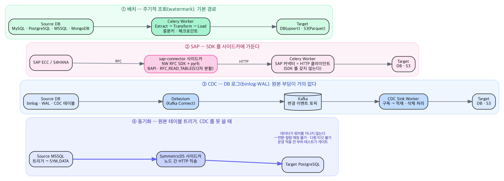

# 아키텍처

ditter 가 어떻게 짜여 있고, **왜 그렇게 됐는지**. 코드를 읽기 전에 알면 시간을 아끼는 것들이다.

이 문서가 다루는 것은 구조와 결정이다. 기능별 사용법은 [README](../README.md), 저장소에서
일할 때의 규칙은 [CLAUDE.md](../CLAUDE.md), 커밋·브랜치 규칙은
[docs/conventions/](conventions/) 에 있다.

원본 기획 문서(`EAI_아키텍처_설계문서.docx` · `.pdf`)는 부록으로 남는다 — 바이너리라 diff 도
리뷰도 되지 않아, **설계의 진실은 이 문서와 코드**다. 둘이 갈리면 낡은 쪽이 문서다.

---

## 1. 한눈에

이기종 저장소(RDB · NoSQL · SAP)의 데이터를 표준화된 방식으로 모아 목적 저장소(DB · S3)로
적재하는 자체 EAI 플랫폼이다. 두 얼굴이 있다.

- **SQL 콘솔** — 여러 연결을 한 화면에서 조회한다. 서로 다른 DB 를 한 SELECT 로 조인하는
  [연합 조회](#8-이기종-연합-조회--duckdb)까지 포함한다.
- **파이프라인 캔버스** — 드래그앤드롭으로 수집·변환·적재를 엮어 배치/실시간으로 돌린다.


> 계층보다 **프로세스 경계**를 먼저 본다. 오케스트레이터는 별도 컨테이너가 아니라 api 와
> 스케줄러(beat)가 같은 코드([`services/run_service.py`](../apps/api/src/eai_api/services/run_service.py))를
> 돌리고 — 수동·API 트리거는 api 가, 예약은 beat 가 api 를 거치지 않고 직접 큐에 넣는다 —
> DuckDB 연합 조회 허브는 api 안에서 돈다(그래서 큰 조인이 api 메모리를 쓴다 — §8).
> SAP SDK 는 사이드카에만 있고(§7), 동기화만 데이터가 워커를 지나지 않는다(§6).
> 커넥터 계층은 api(조회)와 worker(적재)가 함께 쓰는 공유 라이브러리다 — 연합 조회만
> 그 계층을 거치지 않고 DuckDB 확장이 직접 붙는다.

```
apps/
  api/             FastAPI(REST·WS) + FastMCP.  메타DB 스키마·마이그레이션의 주인
  worker/          Celery.  파이프라인 실행 엔진
  connectors/      공유 커넥터 라이브러리 — api·worker 양쪽이 쓴다
  sap-connector/   NW RFC SDK 사이드카 (라이선스 바이너리 격리)
  web/             React 18 + React Flow
cdc/debezium/      Kafka Connect 구성
sync/symmetricds/  트리거 기반 실시간 동기화 구성
```

| 영역 | 기술 |
|---|---|
| 프런트 | React 18 · TypeScript · Vite · React Flow · Zustand · TanStack Query |
| 백엔드 | Python 3.12 · FastAPI · FastMCP · SQLAlchemy 2.x · Pydantic v2 |
| 실행 | Celery + Redis · 커스텀 DAG 오케스트레이터 |
| 메타데이터 | PostgreSQL 16 (Alembic 마이그레이션 7개) |
| 실시간 | Debezium(Kafka Connect) · SymmetricDS |
| 분석 | DuckDB + polars (연합 조회) |

---

## 2. 의존 방향 — api 와 worker 는 한쪽으로만 안다

가장 먼저 알아야 할 것이다.

```
api  ──[Redis 큐: send_task("eai_worker.tasks.execute_pipeline")]──>  worker
api  <──────────────[worker 가 eai-api 패키지를 import]──────────────  worker
```

**api 는 worker 코드를 import 하지 않는다.** 이름만 큐에 넣는다
([`run_service.py`](../apps/api/src/eai_api/services/run_service.py)). 반대로 worker 는 메타DB 를
직접 갱신해야 하므로 `eai-api` 패키지(모델·서비스·DAG 스펙)에 의존한다.

그래서 DAG 스펙(`eai_api.schemas.dag`)을 **양쪽이 공유한다.** 정의를 복제하면 반드시 어긋난다.

`apps/connectors/` 는 그 아래에 있다 — api(연결 테스트·스키마 탐색·쿼리)와 worker(실제 적재)가
같은 계약을 쓴다. 그래서 **커넥터 변경은 항상 먼저 커밋한다.** 계약이 깨지면 양쪽에서 드러나야 한다.

---

## 3. 실행 모델 — 타깃 주도 풀 스트리밍

파이프라인은 노드와 엣지로 된 DAG 다. 실행은 **타깃이 당기는 방향**으로 일어난다.

타깃마다 상류를 거슬러 제너레이터 체인을 만들고, 타깃이 배치를 당겨오면서 흐름이 생긴다
([`engine._build_stream`](../apps/worker/src/eai_worker/engine.py)). 중간 결과가 메모리에 쌓이지
않아 대용량에서 메모리가 상수로 유지된다.


> 선의 종류가 이 그림의 요점이다. 실선은 잡이 흐르는 길, 파선은 상태를 쓰고 읽는 길, 점선은
> 이벤트다. **진실의 원천은 언제나 메타DB 이고 이벤트는 부가 채널**이다
> ([`services/events.py`](../apps/api/src/eai_api/services/events.py)) — 워커가 Redis 로
> publish 하고 api 의 WebSocket 이 구독해 밀어 주되, 구독자가 없어 놓쳐도 UI 는 REST 로 같은
> 상태를 복원한다. 오케스트레이터는 별도 프로세스가 아니라 **api 안**이다
> ([`services/run_service.py`](../apps/api/src/eai_api/services/run_service.py)).

### 이 모델이 만드는 결과들

**소스 앞에는 트리거만 올 수 있다.** `_stream_of` 는 소스를 만나면 상류를 조립하지 않고 곧장
`read()` 한다. 소스→소스로 이어 두면 화면에는 이어져 보이고 실행도 성공하는데 상류 데이터만
조용히 사라진다. 가장 찾기 어려운 종류라 **양쪽에서 막았다** — 캔버스 `onConnect` 가 연결 자체를
거절하고, 저장된 정의는 검증이 에러로 잡는다.

> 이것이 이 저장소의 반복되는 규칙이다: **못 하는 일은 그릴 수 없게 한다.** 그릴 수 있는데
> 아무 일도 안 일어나는 것이 가장 나쁜 결과다.

**여러 상류가 한 노드로 모이면 순차 concat(UNION ALL)이다.** 조인은 노드로 지원하지 않는다.

**한 노드가 여러 소비자를 가지면 스풀로 팬아웃한다.** 첫 소비 때 JSONL 로 디스크에 적고 나머지는
되읽는다([`spool.py`](../apps/worker/src/eai_worker/spool.py)). 소스는 정확히 한 번만 읽힌다.
대신 **엔진은 타깃을 순차 실행해야 한다** — 병렬로 돌리면 스풀이 완성되기 전에 두 번째 소비자가
붙어 `_replay` 가 `RuntimeError` 를 던진다.

### 순서가 중요한 것

- **워터마크는 모든 타깃이 성공한 뒤에만 전진한다.** 적재 전에 올리면 실패 구간이 영구 유실된다.
  체크포인트 저장 실패는 Run 을 실패로 만든다 — 조용히 넘어가면 다음 실행이 같은 구간을 건너뛴다.
- **DB overwrite 는 첫 배치에서만 테이블을 비운다.** 매 배치 비우면 마지막 배치만 남는다.
- **S3 overwrite 는 적재 전에 `run_id=` prefix 를 정리한다.** 재시도 시 이전 파트가 중복으로 남는다.

---

## 4. 커넥터 계약

새 소스·타깃을 붙이는 것은 [`BaseConnector`](../apps/connectors/src/eai_connectors/base.py)
프로토콜 하나를 구현하는 일이다.

```python
class BaseConnector(Protocol):
    def test_connection(self) -> HealthResult: ...
    def discover_schema(
        self, table: str | None = None, *, include_pk: bool = True, include_columns: bool = True
    ) -> list[TableSchema]: ...
    def read(self, spec: ReadSpec) -> Iterator[RecordBatch]: ...
    def write(self, batch: RecordBatch, mode: WriteMode) -> WriteResult: ...
    def close(self) -> None: ...
```

`discover_schema` 의 `table` 인자는 SAP 때문에 생겼다. **SAP 은 테이블이 수만 개라 열거가
불가능**하므로 그쪽에서는 사실상 필수이고, RDB·Mongo 에서는 지정 시 조회 비용을 아끼는
최적화가 된다. 연결은 "어디에 붙는가"이지 "무엇을 읽는가"가 아니다 — 그래서 읽을 대상은
연결이 아니라 이 인자와 노드 설정이 정한다.

- **`read` 는 제너레이터다.** 한 번에 다 읽지 않는다. 증분키·워터마크는 `ReadSpec` 으로 받는다.
- **커넥터별 옵션은 `ReadSpec.params` 로만 전달된다.** 새 커넥터를 만들 때 기억할 것.
- 커넥션 풀을 유지하고 재시도(지수 백오프)를 내장한다([`retry.py`](../apps/connectors/src/eai_connectors/retry.py)).

### `ReadSpec` — 소스를 가리키는 세 가지 방법

`table` · `query` · `function` 중 **하나는 반드시** 있어야 한다.

처음에는 `table | query` 둘뿐이었다. SAP BAPI 를 붙이면서 **둘 다 아닌 소스**가 나왔고,
워크어라운드 대신 계약을 고쳤다. 계약이 현실을 못 담으면 계약을 고치는 것이 맞다.

### 지금 있는 커넥터

| 종류 | 커넥터 |
|---|---|
| SQL | `mysql` · `postgres` · `mssql` (`SqlConnector` 상속 — URL·MERGE 문만 다르다) |
| 문서 | `mongo` (스키마가 없어 `BaseConnector` 를 독립 구현) |
| 객체 | `s3` · `local_file` |
| 원격 함수 | `sap_rfc` (사이드카 경유) |
| AI 모델 | `gemini` · `bedrock` · `ollama` |

`registry.py` 가 **지연 로딩**한다. 임포트 시점에 드라이버를 다 불러오면 fork 하는 순간 드러난다
([§10](#10-임포트는-싸야-한다)).

### AI 모델도 커넥터다

`ai_service.chat()` 은 `.generate()` 를 가진 커넥터면 무엇이든 받는다 — **벤더를 모른다.**
그래서 Ollama(로컬 오픈웨이트) 지원을 더하는 데 커넥터 하나를 추가하는 것으로 끝났고,
서비스·라우터·프론트 로직은 손대지 않았다.

이것이 "AI 를 어떻게 붙일 것인가"에 대한 이 저장소의 답이다. **AI 를 특별 취급하지 않는다.**

---

## 5. 메타데이터 모델

```
Connection   type · config(jsonb) · secret_ref · allowed_statements · auto_commit
Pipeline     definition(jsonb: nodes+edges) · version · schedule(cron)
Run          status · trigger · started_at · records · node_states(jsonb)
RunLog       run_id · node_id · level · message
Checkpoint   pipeline_id · node_id · watermark / cdc_offset(jsonb)
CdcStream    engine(debezium | symmetricds) · status · config(jsonb)
User         email · password_hash(Argon2id) · role · external_id
```

- **시크릿 원문은 저장하지 않는다.** `secret_ref` 만 두고 실제 값은 KMS/시크릿 매니저에서 복호화한다.
  [`schemas/connection.py`](../apps/api/src/eai_api/schemas/connection.py) 의 `SECRET_KEYS` 에 든
  필드는 평문으로 메타DB 에 남지 않는다 — DB 를 직접 봐도 흔적이 없다. 커넥터를 추가하면서
  비밀 성격의 키를 빠뜨리는 것을 **테스트가 막는다**(`test_secret_coverage.py`).
- **`definition` 은 노드·엣지를 담은 DAG 다.** 실행 시 위상 정렬 후 처리한다.
- **컬럼을 함부로 늘리지 않는다.** `allowed_statements`·`auto_commit` 은 타입마다 다른 정책이라
  `config` 안에 산다 — 마이그레이션도 필요 없다.

### 워터마크에는 타입 태그가 붙는다

`datetime`·`Decimal` 워터마크는 JSONB 에 그대로 들어가지 않는다. `engine._encode_watermark` 가
타입 태그를 붙여 저장한다 — **태그를 잃으면 다음 비교가 조용히 어긋난다.**

---

## 6. 수집 방식 세 갈래

같은 문제(원본의 변경을 타깃으로 옮긴다)에 대한 답이 셋이고, **고르는 기준이 다르다.**

| | 배치 | CDC (Debezium) | 동기화 (SymmetricDS) |
|---|---|---|---|
| 잡는 법 | 주기적 조회 (watermark) | DB 로그(binlog·WAL) | 원본 테이블에 **트리거** |
| 지연 | 스케줄 주기 | 초 단위 | 라우팅 주기(기본 10초) |
| 원본 부담 | 조회 부하 | 거의 없음 | **쓰기마다 트리거** |
| 데이터가 지나는 곳 | 워커 | Kafka → 워커 | **워커를 지나지 않는다** |
| 변환·컬럼 매핑 | 된다 | 된다 | **불가능** |
| 언제 쓰나 | 기본 | 원본이 로그 기반 CDC 를 지원 | 원본이 CDC 를 못 쓸 때 |

**동기화만 데이터가 우리 프로세스를 지나지 않는다.** SymmetricDS 가 원본에서 타깃 DB 로 직접
옮긴다. 그래서 변환·다중 타깃이 성립하지 않고, 캔버스와 검증 양쪽에서 그리지 못하게 막는다.



> **위 표의 셋(배치 · CDC · 동기화)에 SAP(§7)을 더한 넷**이다. SAP 만 기준이 하나 다르다 —
> 나머지 셋이 "변경을 어떻게 잡는가"라면 SAP 은 "무엇에서 읽는가"라서 이 표에는 들어가지
> 않는다. 그림에서 읽어야 할 것은 둘이다: ②의 SAP SDK 가 워커가 아니라 사이드카 안에 있고,
> ④만 화살표가 워커를 건너뛴다.

동기화 경로는 **구현은 끝났지만 실환경 검증 전이고, 트리거 기반이라 운영 적용 전 부하 테스트가
게이트다.** 착수 점검(`sync_service.preflight`)이 그 게이트를 코드로 강제한다 — 다만 부하 테스트
여부는 코드가 판정할 수 없어 경고로만 알린다.

---

## 7. SAP — 라이선스 바이너리를 격리한다

```
worker ──HTTP──> sap-connector 사이드카 ──RFC──> SAP
 (SDK 없음)              (SDK 여기만)
```

NW RFC SDK 는 SAP 라이선스가 있어야 받는 **독점 바이너리**라 저장소에도 pip 에도 없다. 워커
이미지에 넣으면 SAP 를 안 쓰는 파이프라인까지 그 이미지에 묶인다.

`eai_connectors/sap_rfc.py` 는 SAP 라이브러리를 **한 줄도 임포트하지 않는다.**

**접속 정보와 SDK 는 다른 문제다.** 처음엔 둘을 묶어 사이드카 `.env` 에 뒀는데, 그러면 SAP
시스템마다 컨테이너를 새로 띄워야 했다. 지금은 갈라져 있다 — 접속 정보는 다른 커넥터처럼
**연결 설정에 암호화 저장**되고 요청 body 로 전달된다. 사이드카는 접속 정보별로 커넥션을
캐시하는 **순수 게이트웨이**다.

SDK 없이 개발·검증할 수 있도록 목 백엔드가 있는데, **제약을 눙치지 않는다** — 512자 행폭, 72자
OPTIONS 줄, ROWSKIPS/ROWCOUNT 를 SAP 과 똑같이 강제한다. 제약을 봐주는 목은 분할 로직을
검증하지 못하므로 있으나 마나다.

### `RFC_READ_TABLE` 의 함정 둘

1. **행 폭 512자** — 넘으면 필드를 그룹으로 쪼개 여러 번 부르고 행 위치로 병합한다. 그런데 SAP 은
   `ORDER BY` 없이 순서를 보장하지 않으므로, 그룹 간 행 수가 다르면 **조용히 잇지 않고
   `SPLIT_ROW_MISMATCH` 로 실패시킨다.**
2. **OPTIONS 한 줄 72자** — WHERE 절을 자르되 **토큰 경계에서만** 잘라야 한다. 리터럴 중간에서
   끊으면 ABAP 이 거부한다.

**BAPI 는 예외를 던지지 않는다.** 실패해도 호출은 성공하고 `RETURN` 테이블에 `E`/`A` 메시지가
담긴다. 확인하지 않으면 실패를 성공으로 착각한다.

---

## 8. 이기종 연합 조회 — DuckDB

서로 다른 연결의 테이블을 한 SELECT 로 조인한다.

```sql
SELECT a.code, b.name
FROM   mysql_wms.wms.aaa a
JOIN   postgre_mes.mes.k123.bbb b ON b.id = a.id
```

DuckDB 를 가운데 두고 각 연결을 카탈로그로 붙인 뒤(ATTACH) 한 문장으로 조인한다. 결과를
파이썬으로 꺼내는 구간은 polars(Arrow → 행)가 맡는다.

**사용자에게 DuckDB 를 보이지 않는다.** ATTACH·DSN·카탈로그 별칭은 전부 서버가 만들고, 사용자가
아는 것은 「연결 관리」에 저장해 둔 이름뿐이다. DuckDB 자체 문법도 아니다 — DuckDB 는 3단계까지만
알아서, 실행 전에 참조를 찾아 카탈로그 이름으로 **바꿔 쓴다**(`rewrite`).

### 붙이는 순서가 곧 안전장치다

1. 확장을 올린다 → 2. 카탈로그를 **READ_ONLY** 로 붙인다 → 3. `disabled_filesystems` 로 로컬 파일
접근을 끊는다 → 4. 그제서야 사용자 SQL 을 돌린다.

**거꾸로 할 수 없다.** `ATTACH` 도 파일 시스템 계층을 거치므로 먼저 잠그면 붙는 것 자체가 막히고,
이 설정은 되돌릴 수도 없다. 그래서 카탈로그가 늘어날 때마다 허브를 새로 만들어 다시 한다.

### 자격증명은 연결 문자열이 아니라 DuckDB 시크릿으로

`CREATE SECRET` 을 만들고 `ATTACH '' … (SECRET …)` 으로 붙인다. 이유가 셋이다.

1. **파싱 규칙이 확장마다 다르다.** MySQL 확장은 값의 따옴표를 벗기지 않고(`host='h'` → 호스트가
   `'h'` 가 된다) 포트는 정수로 곧장 읽는다(`port='3306'` → `invalid stoi argument`).
2. 그래서 **공백·따옴표가 든 비밀번호를 안전하게 실을 방법이 없다.**
3. **실패 메시지에 자격증명이 안 실린다.** ATTACH 는 실패하면 연결 문자열을 그대로 에러에 담는다.

지원은 **MySQL · PostgreSQL · SQL Server** 다. 기준은 "공식이냐"가 아니라 **`ATTACH` 를 등록하는
확장이 있느냐**다. MongoDB 는 낄 수 없고, `odbc_scanner` 도 설치·로드는 되지만
`ATTACH … (TYPE ODBC)` 를 등록하지 않아 카탈로그가 없다.

---

## 9. 두 층으로 갈라 두는 것들

이 저장소에 반복해서 나오는 패턴이다. **"이 시스템은 무엇이 가능한가"(서버)와 "지금 나는 어떻게
쓸 것인가"(브라우저)는 다른 질문**이므로 사는 곳을 갈라 둔다.

| | 서버가 지키는 것 | 브라우저에 사는 것 |
|---|---|---|
| SQL 실행 | 연결의 **허용 명령**(`config.allowed_statements`) | 태그를 눌러 **잠시 끄기** |
| 트랜잭션 | 연결의 `auto_commit` 기본값 | 툴바 토글(연결별 덮어쓰기) |
| AI | 등록된 AI 연결과 그 모델 | **AI 기본 연결** · 패널의 모델사 칩 |

브라우저 쪽은 **보안 경계가 아니다.** 서버에 두면 뜻이 달라진다 — 남이 켠 것을 내가 끄는 셈이
되는데, 이건 남이 아니라 내 손을 막는 장치다.

### 넓히는 방향으로 실패하지 않는다

`allowed_statements` 가 없거나 깨져 있으면 `("select",)` 로 본다. 프런트의 기본값도 같아야 한다 —
다르면 화면의 태그가 거짓말을 한다.

### 선두 명령만 보면 놓친다

`WITH d AS (DELETE FROM t RETURNING *) SELECT * FROM d` 는 선두가 `WITH` 라 읽기로 보이지만
쓰기다. 그래서 선두 명령을 대조한 **뒤에** 문장 안에 남은 쓰기 키워드도 전부 확인한다.

### 쓰기는 `read()` 로 태우면 안 된다

`SqlConnector.read` 는 스트리밍 커서를 열고 **커밋하지 않는다.** UPDATE 를 그 경로로 보내면
문장은 실행되는데 **그대로 사라진다.** 그래서 `execute` 를 따로 두고 `engine.begin()` 으로 감싼다.

### 트랜잭션은 프로세스 메모리에 산다

열린 트랜잭션은 **커넥션 하나를 붙잡은 채** 여러 HTTP 요청에 걸쳐 살아야 한다. 상태를 Redis 로
옮겨도 **커넥션 자체는 옮길 수 없다.** api 프로세스를 늘리면 커밋 요청이 다른 프로세스로 갈 수
있고, 그때는 **분명히 실패한다** — 조용히 새 트랜잭션을 열지 않는다. 지금 배포는 uvicorn 단일
프로세스라 성립하며, 늘릴 때는 스티키 세션이 전제다.

잊힌 트랜잭션은 **롤백**한다(커밋이 아니다). 사람이 누르지 않은 확정을 서버가 대신하면 되돌릴
방법이 없다.

---

## 10. 임포트는 싸야 한다

macOS 에서 Celery prefork 워커가 `fork()` 할 때 ObjC 런타임이 초기화 중이면 자식이 `SIGABRT` 로
죽는다. 원인이 둘이었고 **둘 다 임포트 시점에 네이티브 작업을 하고 있었다.**

1. `eai_connectors/__init__` 이 pyodbc·pymongo·boto3 를 전부 임포트 → PEP 562 지연 로딩으로 전환
2. `auth/passwords.py` 가 임포트 시점에 Argon2 더미 해시를 계산 → 첫 사용 시로 미룸

무거운 초기화를 모듈 최상위에 두면 fork 하는 순간 드러난다. Linux 컨테이너에서는 증상이 다르게
나타날 뿐 문제 자체는 같다.

---

## 11. 새 것을 붙이는 법

### 새 커넥터

1. `apps/connectors/src/eai_connectors/<이름>.py` 에 `BaseConnector` 구현
2. `registry.py` 에 지연 로더와 허용 키(`_<이름>_KEYS`) 등록
3. 프런트 `CONNECTOR_SPECS` 에 필드 등록 — **키가 백엔드와 같아야 한다.** 다르면 `extra` 로 조용히 버려진다
4. 단위 테스트 동반 (커넥터·노드는 예외 없음)

### 새 노드 타입

1. `eai_api.schemas.dag` 에 타입·파라미터 추가 (api·worker 공유 스펙)
2. `apps/worker/src/eai_worker/nodes/` 에 실행기
3. 캔버스 팔레트·`ConfigPanel` 에 UI
4. **그릴 수 없어야 하는 연결이 있으면 `onConnect` 와 검증 양쪽에** 막는다

### 양쪽에 있는 상수 — 한쪽만 고치면 어긋난다

| 상수 | 백엔드 | 프런트 |
|---|---|---|
| `SQL_STATEMENTS` | `connection_service.py` | `api/statements.ts` |
| `DUCK_TYPES` | `duck_service.py` | `canvas/duckRefs.ts` |
| `SYNC_CHANNELS`·`SYNC_PURPOSES` | `schemas/dag.py` | `api/types.ts` |
| 역할 계층 | `auth/rbac.py` 의 `_IMPLIES` | `auth.can()` |
| 변수 치환 문법 | `schemas/variables.py` | `canvas/variables.ts` |

한쪽만 늘리면 **화면에는 보이는데 저장·실행이 거부된다.**

---

## 12. 택하지 않은 것과 그 이유

이 저장소에서 가장 값이 나가는 목록이다. 없는 기능은 대개 못 만든 것이 아니라 **안 만든 것**이다.

| 안 한 것 | 이유 |
|---|---|
| 조인 노드 | 스트리밍(타깃 주도 풀) 모델과 맞추는 방법이 먼저다. 지금은 순차 concat |
| 파이프라인 노드로서의 연합 조회 | 워커에도 DuckDB 를 넣어야 하고, 위와 같은 문제가 걸린다 |
| 연합 조회의 쓰기 | 단일 SELECT/WITH 만 통과하고 ATTACH 는 전부 READ_ONLY |
| SAP 를 타깃으로 | EAI 는 SAP 에서 읽어오는 방향이라 범위 밖 |
| 동기화의 변환·컬럼 매핑 | 데이터가 워커를 지나지 않아 **구조상 불가능**. CDC 경로나 타깃 뷰로 |
| 행 번호 참조 `${주문[1].id}` | SQL 은 `ORDER BY` 없이 순서를 보장하지 않는다. 첫 행과 전체로 충분 |
| SAVEPOINT(부분 롤백) | 문장 이력이 필요하고, 그건 편집기가 아니라 마이그레이션 도구의 일 |
| 실행 전 확인 대화상자 | 허용 명령이 이미 관문이다. 창을 하나 더 두면 그것부터 습관적으로 넘긴다 |
| 파이프라인 탭 여러 개 동시 편집 | `useCanvasStore` 가 모듈 전역 싱글턴. 팩토리+Context 로 바꾸면 10개 파일이 함께 움직인다 |
| 임베딩·RAG | 스키마 문맥은 메타DB 에서 직접 읽어 조립한다 — 검색이 아니라 조회다 |
| OAuth2/OIDC IdP 연동 | 스키마(`users.external_id`)만 준비. 인증은 현재 JWT + RBAC |

---

## 13. 검증되지 않은 것

문서가 조용히 넘어가면 안 되는 자리다.

- **동기화(SymmetricDS)의 실환경 E2E** — 단위 테스트로만 검증했다. 트리거 기반이라 **운영 적용 전
  부하 테스트가 게이트**이고, 부하 테스트는 운영에 쓸 라우팅 주기 그대로 재야 한다.
- **실제 SAP 시스템** — 목 백엔드로만 확인했다. SNC(보안 네트워크 통신)도 미검증.
- **MSSQL·MongoDB 실서버** — 단위 테스트만. 접근 가능한 인스턴스가 없었다.
- **트랜잭션의 방언별 락 동작** — 의미는 SQLite 로 확인했다(커밋·롤백·read-your-writes).
- **mypy(strict)** — src 기준 127건이 남아 CI 게이트가 아니다. 줄여 나가는 중.

---

## 14. 더 읽을 것

| | |
|---|---|
| [README.md](../README.md) | 기동·사용법·화면 |
| [CLAUDE.md](../CLAUDE.md) | 기능별 결정 근거의 전문(§14~§25) |
| [CONTRIBUTING.md](../CONTRIBUTING.md) | 기여 절차 |
| [docs/conventions/](conventions/) | 커밋·브랜치·머지 규칙 |
| [demo/README.md](../demo/README.md) | 시연용 가상 DB |
| [sync/symmetricds/README.md](../sync/symmetricds/README.md) | 동기화 운영 안내 |
| `docs/EAI_아키텍처_설계문서.docx` · `.pdf` | 원본 기획 문서(부록) |
